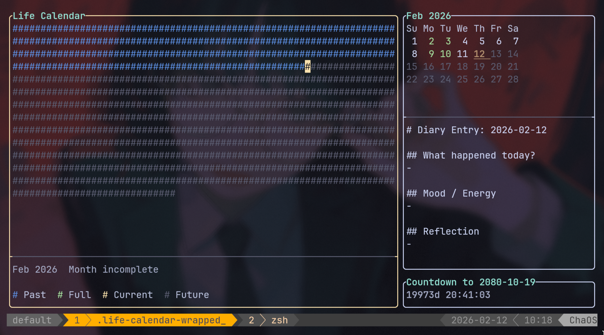

# Life Calendar

A terminal-based **Life Calendar** TUI that visualizes your entire life as a grid of monthly squares — from birth to expected death date. Select a month and open day-by-day diary entries in your preferred editor.



## Features

- 📅 **Visual life grid** — each square = one month of your life
- 🎨 **Color-coded** — past, current, future, and full-diary months
- 🖱️ **Mouse + keyboard** — click or navigate with hjkl/arrows, Enter to edit
- 📝 **Day-by-day diary** — open notes for past or current dates only
- 🧩 **Three-panel layout** — life grid, month view, countdown
- ⏳ **Countdown clock** — time remaining to the configured end date

## Quick Start

```bash
# Enter dev shell
nix develop --impure

# Build
mkdir -p build && cd build
cmake .. && make -j$(nproc)

# Run (from project root)
cd ..
./build/life-calendar
```

Or pass a custom config path:

```bash
./build/life-calendar /path/to/config.toml
```

## Config

Create `config.toml` in the project directory or `~/.config/life-calendar/config.toml`:

```toml
birth_date = "2000-01-01"
death_date = "2080-01-01"
editor = "vi"
diary_dir = "~/.life-calendar/diary"
diary_template = "~/.life-calendar/template.md"
```

| Field            | Description                        | Default                        |
| ---------------- | ---------------------------------- | ------------------------------ |
| `birth_date`     | Your birth date (YYYY-MM-DD)       | `2000-01-01`                   |
| `death_date`     | Expected end date (YYYY-MM-DD)     | `2080-01-01`                   |
| `editor`         | Editor command to open diary files | `vi`                           |
| `diary_dir`      | Directory for diary `.md` files    | `~/.life-calendar/diary`       |
| `diary_template` | Optional template for new notes    | `~/.life-calendar/template.md` |

Template placeholders (used only when creating a new file):

- `{date}` -> `YYYY-MM-DD`
- `{year}` -> year as number
- `{month}` -> month as number
- `{day}` -> day as number

## CLI Arguments

The application supports several arguments for automation (e.g., for use in startup scripts or status bars):

| Argument                      | Description                                               |
| ----------------------------- | --------------------------------------------------------- |
| `-h`, `--help`                | Show the help message and exit                            |
| `--check-today`               | Print `true`/`false` if today's diary exists and exit     |
| `--check-yesterday`           | Print `true`/`false` if yesterday's diary exists and exit |
| `--open-if-today-missing`     | Open the TUI only if today's diary is missing             |
| `--open-if-yesterday-missing` | Open the TUI only if yesterday's diary is missing         |

Example:

```bash
# Only open the calendar if I haven't written anything today
life-calendar --open-if-today-missing
```

## Keybindings

| Key                    | Action                                    |
| ---------------------- | ----------------------------------------- |
| `h/j/k/l` or arrows    | Navigate months or days (panel-dependent) |
| `Tab`                  | Switch focus between panels               |
| `Enter` or mouse click | Open diary for selected day               |
| `Home/End`             | Jump to first/last month or day           |
| `q` or `Esc`           | Quit                                      |

## NixOS Integration

To use the NixOS module and avoid system bloat by sharing `nixpkgs`, add this to your system flake:

```nix
{
  inputs = {
    nixpkgs.url = "github:nixos/nixpkgs/nixos-unstable";
    life-calendar = {
      url = "github:your-username/life-calendar";
      inputs.nixpkgs.follows = "nixpkgs";
      inputs.systems.follows = "systems";
    };
  };

  outputs = { self, nixpkgs, life-calendar, ... }: {
    nixosConfigurations.your-hostname = nixpkgs.lib.nixosSystem {
      modules = [
        # ... your other modules
        life-calendar.nixosModules.default
        {
          programs.life-calendar = {
            enable = true;
            birthDate = "2000-01-01";
            deathDate = "2080-01-01";
            editor = "vi";
            diaryDir = "~/Documents/life";
            diaryTemplate = "~/Documents/life/template.md";
          };
        }
      ];
    };
  };
}
```

## License

MIT
